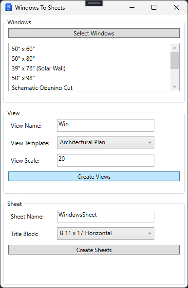

# Author: Abdallah Bakr
# Revit Plugin: Create Window Sheets

This Revit plugin simplifies the process of generating sheets for windows from elevation views. It automates window detection, creates views for each window, and places those views on sheets with dimensions and annotations for documentation.

## Features

- **Automatic Window Detection**: The plugin scans the model to detect all built-in faced windows.
- **Grouping by Type**: Windows are grouped by their type to streamline the process.
- **View Creation**: Elevation views are automatically generated for each window type.
- **Sheet Placement**: The views are placed on sheets, complete with dimensions and annotations for easy documentation.

## Workflow

1. **Window Detection**: The plugin identifies all windows in the active Revit document.
2. **Grouping by Type**: It groups windows based on their unique types.
3. **View Creation**: Elevation views are created for each group of windows.
4. **Sheet Placement**: The created views are placed onto sheets with automatic annotations and dimensions.

## Code Overview
The plugin's main functionality is implemented in the `CreateWindowSheets` class, which performs the following steps:

- **Retrieve Windows**: Uses `GetAllBuiltInFacedWindows()` to collect all windows in the model.
- **Group by Type**: Groups windows by type using `GroupWindowsByType()`.
- **Create Views**: Generates views for each window type with `CreateWindowView()`.
- **Place on Sheets**: Places the views onto sheets with `PlaceViewsOnSheets()`.

## Installation

1. Clone the repository:

   ```bash
   git clone https://github.com/your-username/your-repo-name.git
   ```

2. Open the solution in Visual Studio.

3. Build the project and copy the generated `.dll` file into your Revit add-ins folder.

## Usage

1. Open Revit and load your project.
2. Run the `Create Window Sheets` command from the plugin.
3. The plugin will automatically generate window views, dimension them, and place them on sheets for documentation.

## Example Output

Here�s an example of What I am trying to do. the generated window sheet with views and annotations:




## Contributing

Contributions are welcome! If you encounter any issues or want to improve this project, feel free to submit an issue or a pull request.
